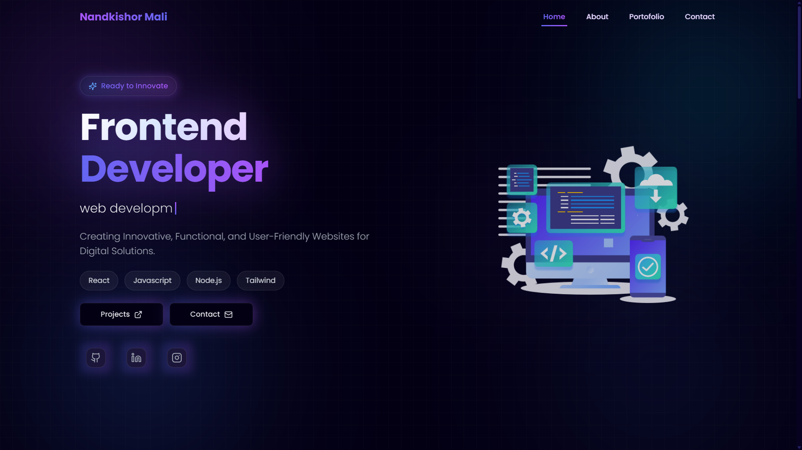

# Portfolio Website 🌟



[](https://github.com/yourusername/portfolio/blob/main/LICENSE)
[](https://reactjs.org/)
[](https://vitejs.dev/)

A feature-rich developer portfolio showcasing professional projects, technical certifications, and seamless contact integration. Built with modern web technologies and optimized for performance.

## 🌟 Key Features

### Project Showcase
- Interactive project cards with live demos & source code links
- Dynamic filtering by technology stack
- Detailed project modal with:
  - Technology breakdown
  - Key challenges & solutions
  - Interactive GIF demos

### Certification Section
- PDF viewer integration for certificates
- Categorization by technology (React, Firebase, etc.)
- Verification badges from issuing platforms

### Enhanced UX/UI
- Smooth page transitions with Framer Motion
- Responsive design with mobile-first approach
- Dark/light theme toggle with local storage
- Loading animations with Lottie files
- 3D hover effects on project cards

### Technical Implementation
- State management with React Context
- Form validation with Formspree integration
- Dynamic routing with React Router v6
- Performance optimizations:
  - Lazy loading components
  - Image compression with Vite
  - Code splitting for efficient bundles

## 🚀 Live Demo

Check out the deployed version: [nandkishor-mali.netlify.app](https://nandkishor-mali.netlify.app)

## 🛠 Tech Stack

**Frontend:**  


**Dev Tools:**  


## 📦 Project Setup

### Environment Variables
Create `.env` file in root directory:
```env
VITE_FORMSPREE_ENDPOINT=your_formspree_id
VITE_GH_PROFILE=your_github_username
VITE_LINKEDIN_PROFILE=your_linkedin_id
```

### Installation Guide
```bash
# Clone repository
git clone https://github.com/yourusername/portfolio.git

# Install dependencies
npm install

# Start development server
npm run dev

# Build for production
npm run build

# Preview production build
npm run preview
```

## 🏗 Component Architecture

```bash
src/
├── components/
│   ├── CardProject/           # Project display cards
│   │   ├── index.jsx          # Main component
│   │   └── ProjectModal/      # Detailed project view
│   ├── Certificate/           # PDF certificate viewer
│   ├── TechStackIcon/         # Animated technology icons
│   └── SocialLinks/           # Contact & profile links
├── pages/
│   ├── Home/                  # Landing page
│   ├── Portfolio/             # Projects showcase
│   ├── About/                 # Skills & experience
│   └── Contact/               # Email contact form
public/
├── certificates/              # PDF certifications
├── projects/                  # Project screenshots
└── tech-icons/                # Technology SVG assets
```

## 📊 Performance Metrics

| Category       | Score | Optimization Techniques |
|----------------|-------|-------------------------|
| Performance    | 97    | Code splitting, lazy loading |
| Accessibility  | 100   | Semantic HTML, ARIA labels |
| Best Practices | 100   | ESLint config, strict mode |
| SEO            | 100   | Meta tags, sitemap.xml |

## 🤝 Contribution Guidelines

1. Fork the repository
2. Create feature branch: `git checkout -b feature/amazing-feature`
3. Commit changes: `git commit -m 'Add amazing feature'`
4. Push to branch: `git push origin feature/amazing-feature`
5. Open a Pull Request

## 📜 License

Distributed under MIT License. See [LICENSE](LICENSE) for more information.

## 📬 Contact

Nandkishor Mali  
[](malinandkishor445@gmail.com)
[](https://www.linkedin.com/in/nandkishor-mali-17b967326/)

## 🌱 Roadmap

- [ ] Add blog section
- [ ] Implement i18n localization
- [ ] Add project video demos
- [ ] Integration with GitHub API
